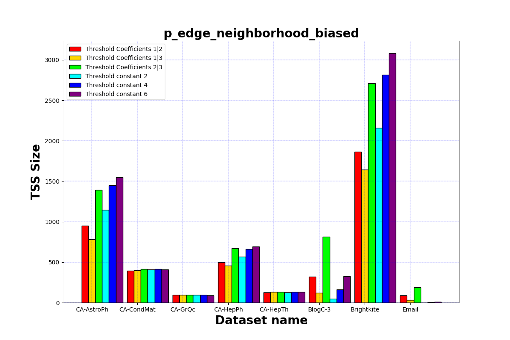
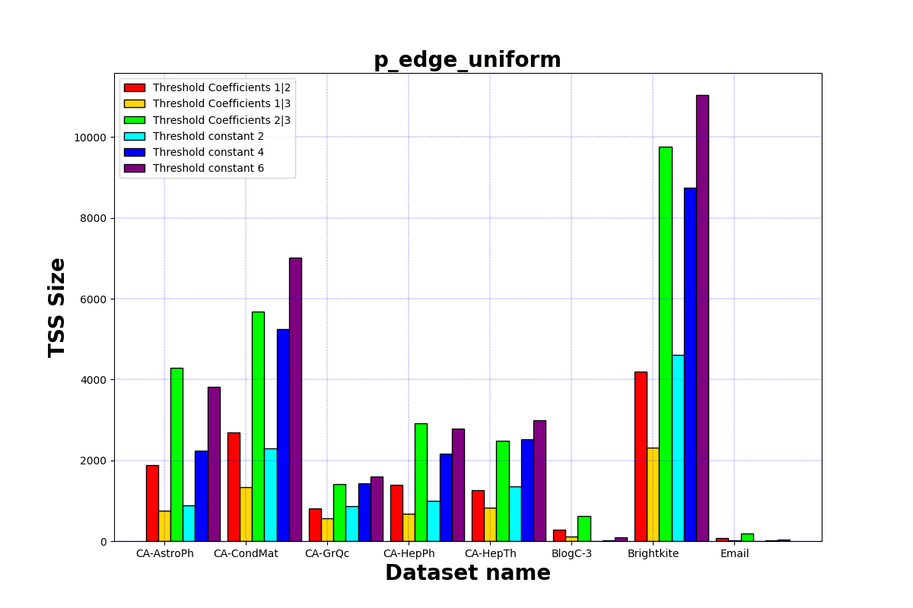
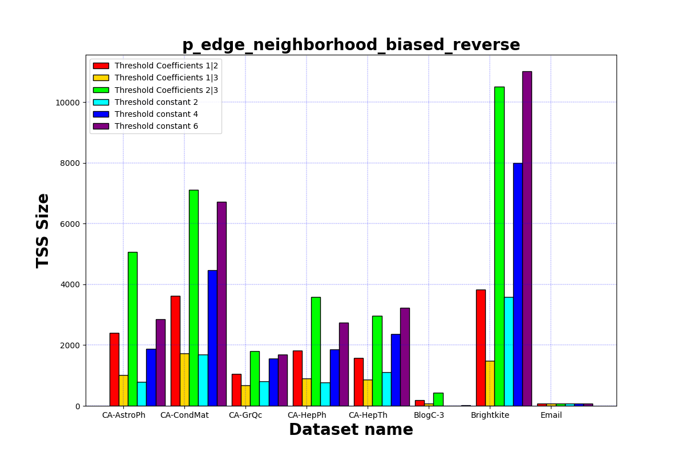

# Target set selection with snap.py

Implmentation of Target Set Selection with snap.py on varius dataset.

#### Run application

1. Create and activate a Python virtual environment

```sh
$ cd tssWithSnappy/
$ python3.7 -m venv ./venv
$ source venv/bin/activate
(venv) $
```

2. Install the dependencies

```sh
(venv) $ python3.7 -m pip install -r requirements.txt
```

3. Run the application

```sh
(venv) $ python3.7 targetsetselection.py -d dataset.txt
```

4. Terminate session

```sh
(venv) $ deactivate
```

### How we test

- 5 runs, for each dataset,  and annote the results;
- Calculate the average;
- Approximate to minor integer.

### Datasets

| Name             | #nodes  | #edges    | Max Deg | Diam | LCC Size | #Triangles  | Clust Coeff | Modul  |
| ---------------- | ------- | --------- | ------- | ---- | -------- | ----------- | ----------- | ------ |
| CA-AstroPh       | 18.772  | 198.110   | 7299    | 14   | 17.903   | 1.351.441   | 0.6309      | 0.3072 |
| CA-CondMat       | 23.133  | 93.497    | 15756   | 14   | 21.363   | 173.361     | 0.6339      | 0.5809 |
| CA-GrQc          | 5.242   | 14.496    | 4234    | 17   | 4158     | 48.260      | 0.5304      | 0.7433 |
| CA-HepPh         | 10.008  | 118.521   | 9647    | 13   | 11.204   | 3.358.499   | 0.6118      | 0.5085 |
| CA-HepTh         | 9.877   | 25.998    | 223     | 17   | 8638     | 28.399      | 0.4718      | 0.6128 |
| Blog_catalog_3   | 10.312  | 333.983   | 4839    | 5    | 10.312   | 5.608.664   | 0.4631      | 0.2374 |
| Brightkite       | 58228   | 214078    | 41      | 16   | 56.739   | 494.728     | 0.1723      | 0.172  |
| email-Eu-core    | 1005    | 16706     | 161     | 7    | 986      | 105.461     | 0.3994      | 0.5391 |

###### Expelanations

<dl>
  <dt><strong>Max Deg (maximum degree)</strong></dt>
  <dd>The maximum possible degree of a node.</dd>
  <dt><strong>Diam (diameter)</strong></dt>
  <dd>Largest minimum distance between two nodes.</dd>
  <dt><strong>LCC Size (strongly connected component sizes)</strong></dt>
  <dd>Distribution of strongly connected component sizes.</dd>
  <dt><strong>Triangles</strong></dt>
  <dd>Number of triangles in the dataset.</dd>
  <dt><strong>Clust Coeff (clustering coefficient)</strong></dt>
  <dd>Measure of the degree to which nodes in a graph tend to cluster together.</dd>
  <dt><strong>Modul (modularity)</strong></dt>
  <dd>Number of triangles in the dataset.</dd>
</dl>

## Results






